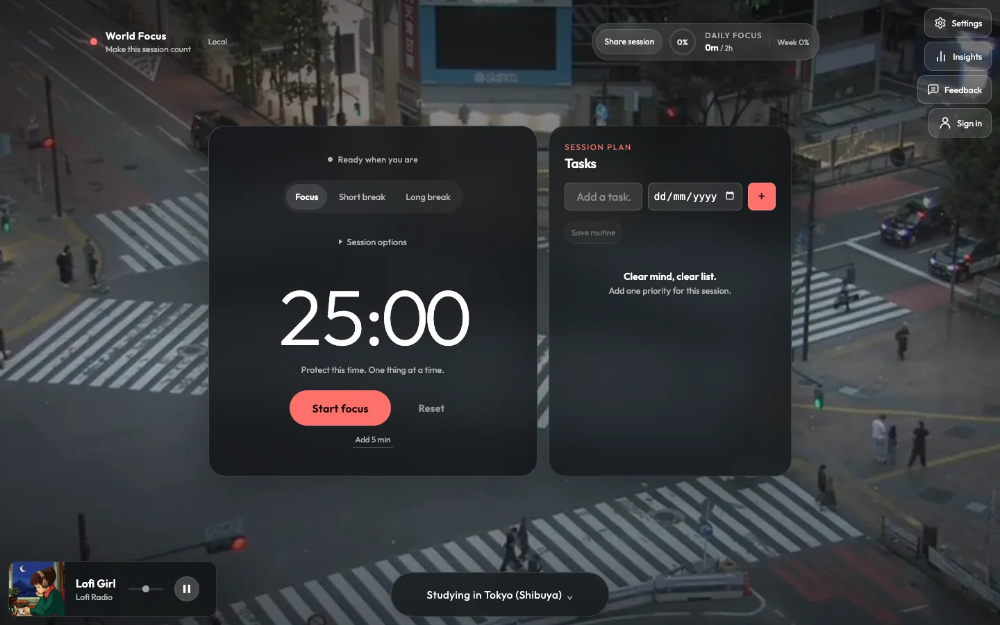
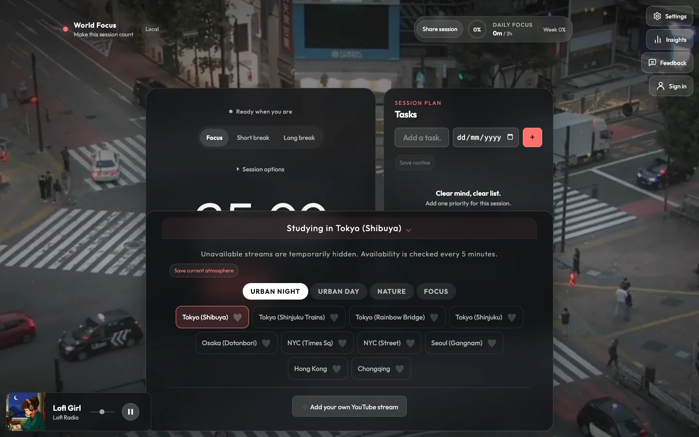
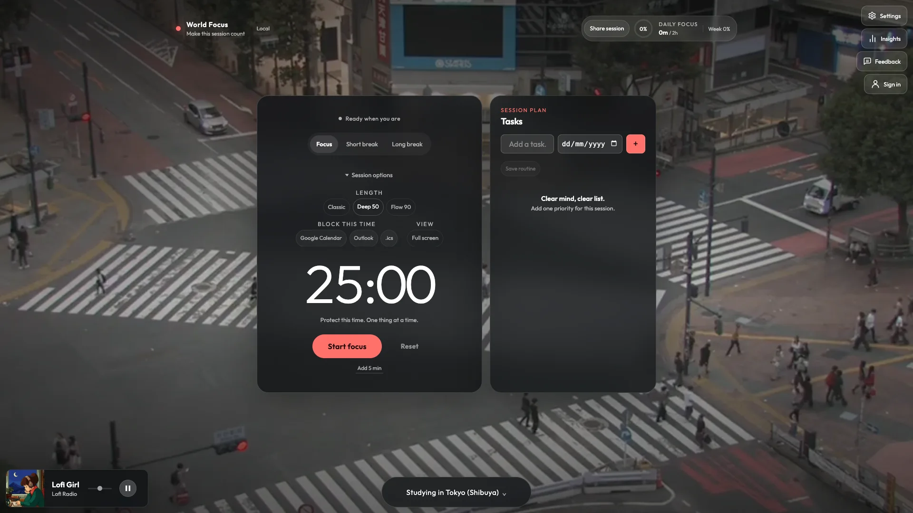
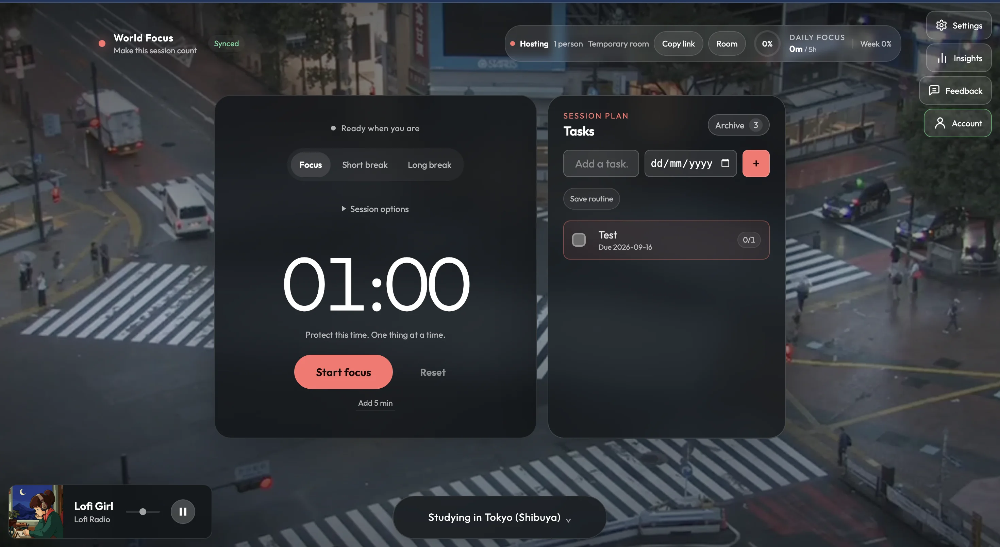
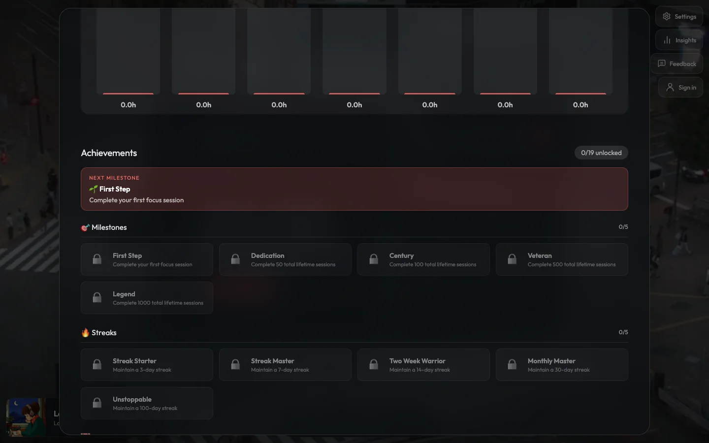

# World Focus

<p align="center">
  <strong>Turn any place into a focus session.</strong><br />
  A calm Pomodoro workspace with live atmospheres, tasks, audio, and progress tracking.
</p>

<p align="center">
  <a href="https://pomodoro-khaki-one.vercel.app"></a>
  <a href="https://github.com/amassias/Pomodoro"></a>
  <a href="LICENSE"></a>
</p>

<p align="center">
  <a href="https://pomodoro-khaki-one.vercel.app">
    
  </a>
</p>

<p align="center">
  <a href="https://pomodoro-khaki-one.vercel.app">Open the live app ↗</a>
  &nbsp;·&nbsp;
  <a href="#demo">Watch the demo</a>
  &nbsp;·&nbsp;
  <a href="#run-locally">Run locally</a>
</p>

## Demo

https://github.com/user-attachments/assets/6097f47b-d045-44a1-a0e8-4547647c785d

<p align="center"><sub>Live atmosphere selection · session presets · active focus timer · Insights</sub></p>

## What it does

- **Focus timer** — Focus, Short break, and Long break modes with Classic, Deep 50, Flow 90, or custom presets.
- **Live atmospheres** — Curated YouTube live views across cities, nature, and focus scenes; favorites, custom streams, temporary quarantine, and retry fallback.
- **Session planning** — Tasks, due dates, estimated sessions, subtasks, routines, calendar blocks, and temporary shared rooms.
- **Audio** — Built-in Lofi radio or optional Spotify playback.
- **Insights** — Total hours, completed sessions, streaks, 28-day consistency, period charts, achievements, and CSV/JSON export.
- **Local-first** — Works without an account using browser persistence; Supabase sync is optional.

## Screenshots

<table>
  <tr>
    <td width="50%">
      <a href="docs/assets/screenshots/atmosphere-selector.webp"></a>
      <br /><sub><b>Choose an atmosphere</b> — switch between live places and focus scenes.</sub>
    </td>
    <td width="50%">
      <a href="docs/assets/screenshots/session-options.webp"></a>
      <br /><sub><b>Shape the session</b> — presets, calendar blocks, and fullscreen mode.</sub>
    </td>
  </tr>
  <tr>
    <td width="50%">
      <a href="docs/assets/screenshots/session-plan.webp"></a>
      <br /><sub><b>Keep the next task visible</b> — plan and focus from one workspace.</sub>
    </td>
    <td width="50%">
      <a href="docs/assets/screenshots/insights-achievements.webp"></a>
      <br /><sub><b>See the progress</b> — consistency, milestones, and achievements.</sub>
    </td>
  </tr>
</table>

## Tech stack

- [React 19](https://react.dev/) + [Vite](https://vitejs.dev/)
- Vanilla CSS with a responsive glass UI
- [Supabase](https://supabase.com/) for optional auth, sync, and shared sessions
- Vercel serverless validation for live YouTube streams
- Vitest + Testing Library for unit and UI tests

## Run locally

```bash
git clone https://github.com/amassias/Pomodoro.git
cd Pomodoro
npm install
npm run dev
```

Open [http://localhost:5173](http://localhost:5173).

Useful checks:

```bash
npm run lint
npm run test:run
npm run build
```

## Optional integrations

### Supabase auth and sync

Create `.env.local` at the repository root:

```bash
VITE_SUPABASE_URL=https://YOUR_PROJECT_REF.supabase.co
VITE_SUPABASE_ANON_KEY=YOUR_SUPABASE_ANON_PUBLIC_KEY
```

Run [`supabase/user_state.sql`](supabase/user_state.sql) in the Supabase SQL editor, then add these redirect URLs:

- `http://localhost:5173/auth-callback`
- `https://pomodoro-khaki-one.vercel.app/auth-callback`

Never expose a Supabase `service_role` key in the frontend.

### Spotify

Add `/spotify-callback` to the Spotify application redirect URIs, then connect from **Settings → Music Provider → Spotify**. Spotify Web Playback requires a Premium account; authentication uses PKCE and does not require a client secret in the frontend.

## Keyboard shortcuts

| Key | Action |
| --- | --- |
| `Space` | Start or pause the timer |
| `R` | Reset the timer |
| `M` | Mute or unmute sounds |
| `Esc` | Close settings or Insights |

## Project structure

```text
api/              Vercel serverless functions
docs/             Product notes, performance docs, sources, and media
public/           Static assets, sounds, icons, and service worker
supabase/         Database schema
src/
  app/             Application shell
  features/        Timer, tasks, atmospheres, audio, Insights, settings…
  hooks/           Shared React hooks
  lib/             Pure logic and colocated tests
  providers/       Auth, user data, and shared-session state
```

## License

MIT — see [LICENSE](LICENSE).
